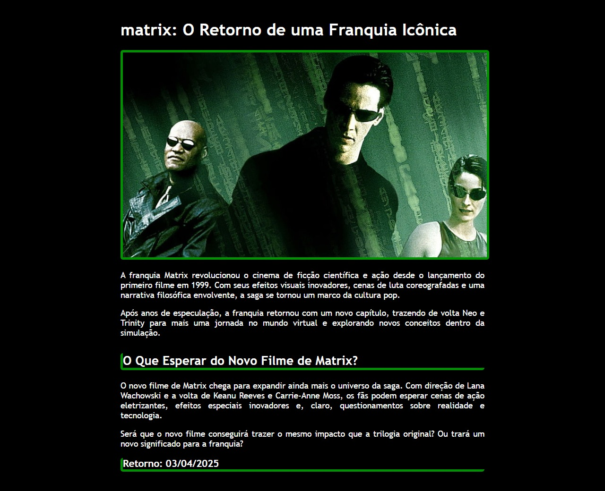

# 🟢 Matrix: O Retorno  

🎥 Um projeto prático para estudar **HTML** e **CSS**, explorando o universo de *Matrix* e seu impacto na cultura pop!  

## 📌 Sobre o Projeto  
Este projeto apresenta um site informativo sobre o retorno da franquia *Matrix*, trazendo detalhes sobre o novo filme, curiosidades e sua influência no cinema e na cultura geek.  

### 💻 Tecnologias utilizadas  
- HTML5  
- CSS3  

## 📸 Preview  
  

## 🚀 Como Executar o Projeto  
1. Clone este repositório:  
   ```bash
   git clone https://github.com/seu-usuario/matrix-retorno.git
   ```
2. Acesse a pasta do projeto:  
   ```bash
   cd matrix-retorno
   ```
3. Abra o arquivo `index.html` no seu navegador.  

## 🎨 Personalização  
Sinta-se à vontade para modificar o código e explorar diferentes estilos no CSS!  

## 📝 Licença  
Este projeto foi criado apenas para fins educacionais.  
